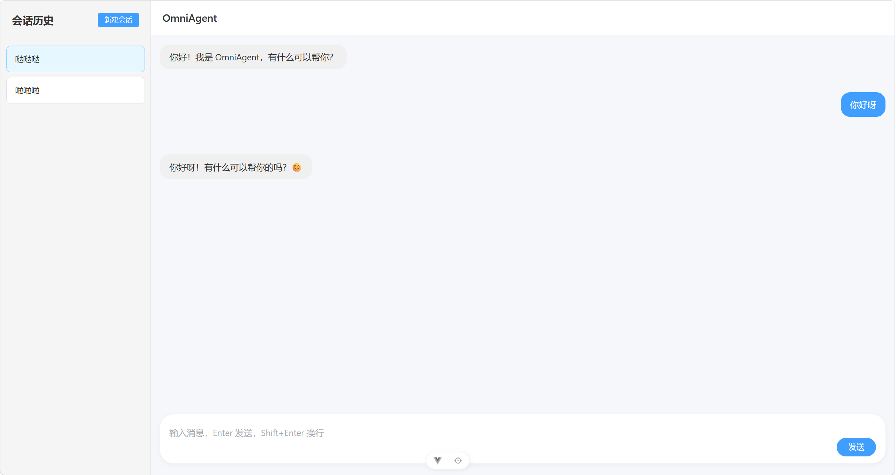
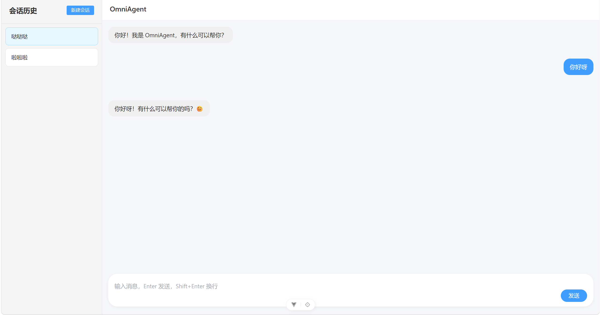
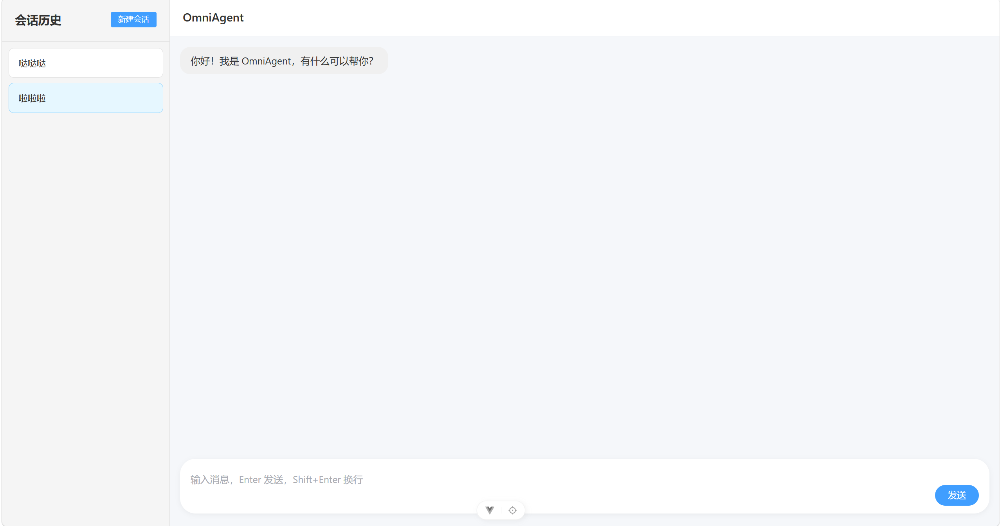
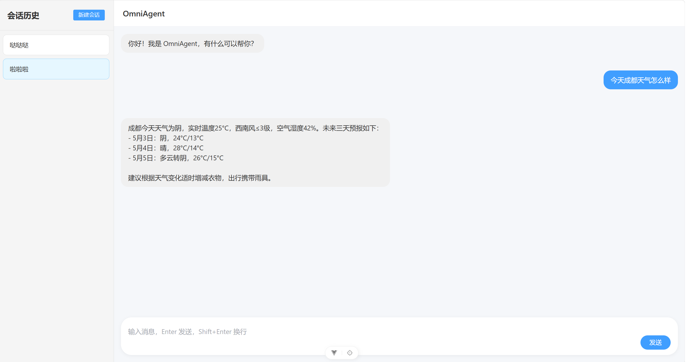
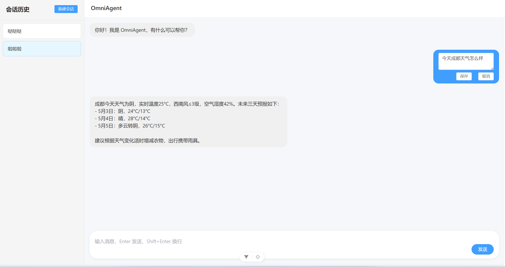
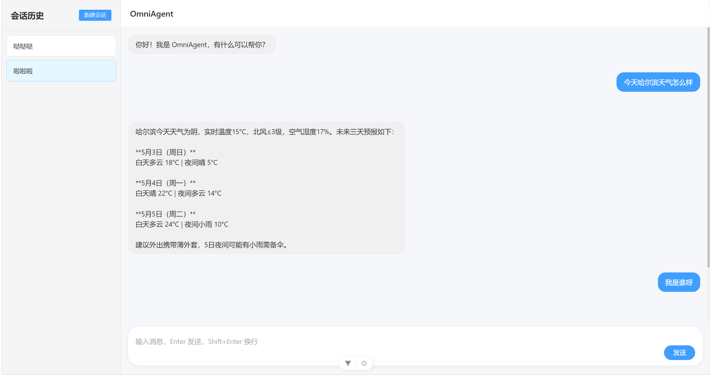
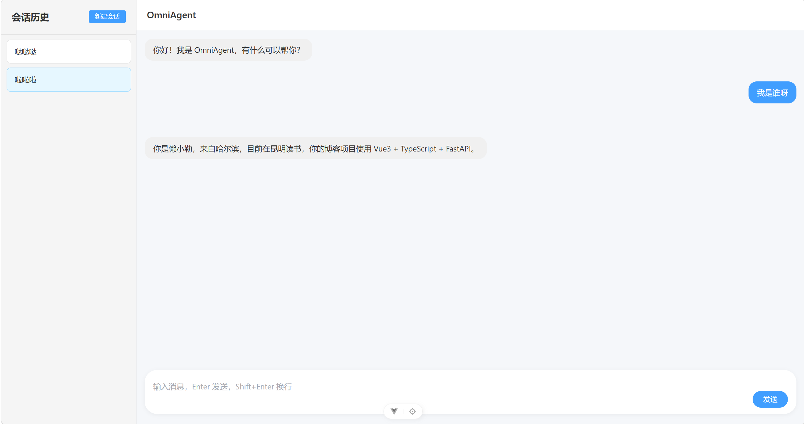

# OmniAgent - 个人智能助手系统

基于 LangChain 1.0 + LangGraph 的全栈智能助手，具备流式对话、自动工具调用、RAG 知识检索、多轮记忆、会话管理等能力。

---

## 🎨 界面预览



---

## ✨ 功能清单

| 功能          | 描述                                            |
| :------------ | :---------------------------------------------- |
| 🏗️ 全栈架构   | Vue3 + FastAPI + LangChain Agent 核心           |
| 💬 流式打字机 | 逐字显示，50ms/字，打字机效果                   |
| ⏸️ 暂停/中止  | 前后端协同，随时中断 Agent 回复                 |
| 🧠 多轮记忆   | AsyncSqliteSaver + 前端 localStorage 双层持久化 |
| 📚 RAG 知识库 | Chroma + OpenAI 兼容 Embedding + MMR 多样性检索 |
| 🌤️ 天气查询   | 高德 API，600s 缓存，支持 3202 个城市           |
| 🕐 时间查询   | 实时获取当前日期时间                            |
| 📝 编辑消息   | 截断对话 + 新 thread_id + 重塑上下文            |
| 💬 会话管理   | 新建/切换/清空，侧边栏管理                      |
| 📜 长对话压缩 | SummarizationMiddleware，100条触发，保留10条    |
| 📊 统一日志   | 控制台 + 文件，按大小滚动，UTF-8 编码           |

---

## ✨ 功能演示

### 会话管理与重命名





### 工具调用（天气查询）



### 编辑消息与上下文重塑





### RAG 知识检索



---

## 🏛️ 架构设计

```text
前端 (Vue3 + TypeScript + Element Plus)
  ├── composables/（useChatMessages / useMessageEdit / useSessionManager）
  ├── components/（ChatContainer / MessageList / MessageItem / ChatInput / Sidebar）
  └── utils/storage.ts（统一 localStorage）
        │
        ▼ HTTP (SSE 流式)
后端 (FastAPI)
  ├── routers/chat.py（/api/chat/stream，SSE 流式，带断连检测）
  ├── services/agent_service.py（薄层转发）
  └── schemas/chat.py（Pydantic 模型）
        │
        ▼
Agent 核心层 (LangChain 1.0 + LangGraph)
  ├── executor.py（Agent 创建、同步/异步调用、流式输出）
  ├── model_factory.py（模型工厂，OpenAI 兼容接口，支持多平台）
  ├── checkpointer.py（AsyncSqliteSaver，对话状态持久化）
  ├── middleware.py（SummarizationMiddleware，长对话压缩）
  ├── config.py（SYSTEM_PROMPT）
  └── tools/（get_current_time / identify_user / get_weather）
        │
        ▼
RAG 模块
  ├── retriever.py（MMR 检索，向量存储缓存）
  ├── builder.py（文档加载、MD5 增量构建）
  └── knowledge/my_knowledge.txt（知识文档）
```

---

## 🚀 快速开始

### 环境要求

- Python 3.10+
- Node.js ^20.19.0 || >=22.12.0
- SQLite 3

### 1. 克隆项目

```bash
git clone <your-repo-url>
cd OmniAgent
```

### 2. 后端配置

```bash
# 方式 1：使用 uv 包管理器（推荐，最快）
uv sync  # 自动安装 pyproject.toml 中定义的所有依赖，同时创建 .venv 虚拟环境
请注意先确定电脑中有uv，否则会报错。若没有，请下载：
pip install uv
# 方式 2：使用 pip
# pip install -r requirements.txt
```

### 3. 激活 uv 虚拟环境

`uv sync` 会自动在项目根目录创建 `.venv` 虚拟环境。使用项目前，请确保激活正确的环境：

```bash
# Windows (PowerShell)：激活虚拟环境
.\.venv\Scripts\Activate.ps1

# 激活后，命令行提示符会显示 (omniagent) 前缀，表示已进入项目环境

# 验证当前环境（可选）
python --version  # 应显示 .venv 中的 Python 版本
where python      # 应指向 .venv\Scripts\python.exe

# 使用环境中的命令（在项目根目录执行）
uvicorn backend.main:app --reload --port 8000  # 启动后端

# 退出虚拟环境（可选）
deactivate
```

**常见问题：**

- **PowerShell 执行策略限制：** 如果激活脚本无法运行，执行以下命令：
  ```powershell
  Set-ExecutionPolicy RemoteSigned -Scope CurrentUser
  ```
  然后重新打开 PowerShell。

- **如何确认当前环境？** 激活后命令行提示符会显示 `(omniagent)` 前缀。

```bash
# 配置环境变量
# Windows (PowerShell):
Copy-Item .env.example -Destination .env

# Linux/Mac:
# cp .env.example .env
```

编辑 `.env`，填入 API Key。配置方式完全遵循 OpenAI SDK 的字段命名：

| 配置项 | 说明 | 必填 |
| :-- | :-- | :-- |
| `LLM_BASE_URL` | LLM 接口地址 | 是 |
| `LLM_API_KEY` | LLM API Key | 是 |
| `LLM_MODEL` | LLM 模型名 | 是 |
| `EMBEDDING_BASE_URL` | Embedding 接口地址 | 是 |
| `EMBEDDING_API_KEY` | Embedding API Key | 是 |
| `EMBEDDING_MODEL` | Embedding 模型名 | 是 |
| `AMAP_API_KEY` | 高德地图 API Key | 否 |

**常用平台配置参考：**

| 平台 | LLM_BASE_URL | EMBEDDING_BASE_URL |
| :-- | :-- | :-- |
| 阿里云百炼 | `https://dashscope.aliyuncs.com/compatible-mode/v1` | `https://dashscope.aliyuncs.com/compatible-mode/v1` |
| DeepSeek | `https://api.deepseek.com` | 不提供，需单独配置 Embedding 平台 |
| OpenAI | `https://api.openai.com/v1` | `https://api.openai.com/v1` |

> DeepSeek 不提供 Embedding API，推荐 LLM 用 DeepSeek，Embedding 用阿里云百炼。

**获取 API Key：**

- 阿里云百炼: [阿里云百炼控制台](https://bailian.console.aliyun.com/cn-beijing#/home)
- DeepSeek: [DeepSeek 开放平台](https://platform.deepseek.com/api_keys)
- OpenAI: [OpenAI Platform](https://platform.openai.com/api-keys)
- 高德地图: [高德开放平台](https://lbs.amap.com/)

### 4. 构建知识库

```bash
# 方式 1：直接运行（推荐）
python -c "from agent_core.rag.builder import build_vector_store; build_vector_store()"

# 方式 2：如果 PYTHONPATH 设置正确
python -m agent_core.rag.builder
```

### 5. 一键启动（推荐）

项目提供了启动脚本，自动启动前后端服务：

```bash
# Windows (PowerShell)
.\start.ps1

# Windows (CMD)
start.bat

# Linux/Mac
chmod +x start.sh
./start.sh
```

启动脚本会自动：
- 检查虚拟环境是否存在
- 启动后端服务（http://localhost:8000）
- 启动前端开发服务器（http://localhost:5173）

### 6. 手动启动（可选）

```bash
# 后端（从项目根目录）
uvicorn backend.main:app --reload --port 8000

# 前端
cd frontend
npm install
npm run dev
```

访问 http://localhost:5173 开始使用。

---

## 📁 项目结构

```text
OmniAgent/
├── agent_core/                  # Agent 核心
│   ├── agent/
│   │   ├── executor.py          # Agent 执行器（同步/异步/流式）
│   │   ├── model_factory.py     # 模型工厂
│   │   ├── checkpointer.py      # 对话持久化
│   │   ├── middleware.py         # 中间件配置
│   │   └── config.py            # 系统提示词
│   ├── tools/
│   │   ├── rag_tool.py          # 身份鉴定工具（identify_user）
│   │   ├── time_tool.py         # 时间工具
│   │   └── weather_tool.py      # 天气工具（高德 API + 缓存）
│   ├── rag/
│   │   ├── retriever.py         # MMR 检索
│   │   └── builder.py           # 向量库构建（MD5 增量）
│   ├── config/
│   │   ├── settings.py          # 全局配置（模型、路径、API Key）
│   │   └── prompt_loader.py     # 提示词加载
│   ├── logger/
│   │   └── setup.py             # 日志配置
│   ├── prompts/
│   │   └── system.txt           # Prompt 模板
│   ├── resources/               # 资源文件
│   │   ├── city_codes.json      # 城市编码
│   │   └── AMap_adcode_citycode.xlsx
│   ├── scripts/                 # 工具脚本
│   ├── tests/                   # 测试模块
│   └── knowledge/               # 知识文档
│       └── my_knowledge.txt
├── backend/                     # FastAPI 后端（标准 Python 包）
│   ├── __init__.py
│   ├── routers/
│   │   ├── __init__.py
│   │   └── chat.py              # 路由（SSE 流式端点）
│   ├── services/
│   │   ├── __init__.py
│   │   └── agent_service.py     # 服务层
│   ├── schemas/
│   │   ├── __init__.py
│   │   └── chat.py              # Pydantic 模型
│   └── main.py                  # 应用入口
├── frontend/                    # Vue3 前端
│   ├── public/
│   ├── src/
│   │   ├── composables/         # 状态管理
│   │   │   ├── useChatMessages.ts
│   │   │   ├── useMessageEdit.ts
│   │   │   └── useSessionManager.ts
│   │   ├── components/          # UI 组件
│   │   │   ├── ChatContainer.vue
│   │   │   ├── MessageList.vue
│   │   │   ├── MessageItem.vue
│   │   │   ├── ChatInput.vue
│   │   │   └── Sidebar.vue
│   │   ├── api/chat.ts          # API 层（fetch + SSE）
│   │   ├── types/chat.ts        # 类型定义
│   │   ├── router/              # 路由
│   │   ├── utils/storage.ts     # localStorage 工具
│   │   ├── App.vue
│   │   └── main.ts
│   ├── package.json
│   └── vite.config.ts
├── docker/                      # Docker 部署文件
│   ├── backend/
│   │   └── Dockerfile
│   ├── frontend/
│   │   ├── Dockerfile
│   │   └── nginx.conf
│   └── .dockerignore
├── chroma_db/                   # 向量库数据（自动生成）
├── logs/                        # 日志文件（自动生成）
├── main.py                      # 命令行入口
├── pyproject.toml               # uv 项目配置
├── requirements.txt             # Python 依赖
├── docker-compose.yml           # Docker 一键编排
├── .env.example                 # 环境变量模板
└── README.md                    # 项目文档
```

---

## 🔧 核心功能详解

### 流式输出（打字机效果）

**数据流：**

```text
Agent 生成 token → astream 推送 → 前端 fetch ReadableStream
→ 逐字拆入打字机队列 → 50ms/字追加到消息气泡
```

**关键实现（executor.py）：**

```python
async def stream_agent(user_input, thread_id):
    agent = await get_async_agent_executor()
    config = RunnableConfig(configurable={"thread_id": thread_id})

    async for chunk in agent.astream(
        {"messages": [{"role": "user", "content": user_input}]},
        config=config,
        stream_mode="messages"
    ):
        token, metadata = chunk  # astream 返回元组！
        if token.content:
            yield token.content
```

**核心踩坑：**

- `astream()` 返回 `(AIMessageChunk, dict)` 元组，不是对象
- `SummarizationMiddleware` 产生的内部 token 会混入流式输出，需通过 `metadata["langgraph_node"]` 和关键词过滤

### 模型配置

所有模型通过 `.env` 环境变量配置，无需修改代码：

| 用途 | 配置项 | 说明 |
| :--- | :--- | :--- |
| **主模型** | `LLM_MODEL` | 在 `.env` 中填写，如 `qwen-plus`、`deepseek-v4-flash` |
| **总结模型** | `LLM_SUMMARIZER_MODEL` | 可选，默认与主模型相同，可单独指定更便宜的模型 |
| **嵌入模型** | `EMBEDDING_MODEL` | 在 `.env` 中填写，如 `text-embedding-v3` |

- LLM 和 Embedding 完全独立，可用不同平台
- 项目统一使用 OpenAI 兼容接口（`ChatOpenAI` / `OpenAIEmbeddings`），支持任何 OpenAI SDK 兼容的服务商

### RAG 检索优化（MMR）

**问题：** 问"我叫什么名字"时，普通相似度检索第一条返回的是性格描述而非名字。

**解决方案：** 使用 MMR（最大边际相关性）检索，强制引入不同主题的文档。

**实现：**

- `retrieve_docs()` 使用 MMR 检索（用于 identify_user 工具）
- `retrieve()` 使用普通相似度搜索（备用）

**核心公式：** `最终分数 = λ × 相关性 - (1-λ) × 与已选文档的相似度`

### 暂停/中止生成

前端 `AbortController` 切断连接 → 后端 `http.disconnect` 监听 → `asyncio.Task.cancel()` → Agent 捕获 `CancelledError` 优雅中止。

**重要发现：** 无需手动清理 SQLite 检查点，LangGraph 内部会自动处理中断状态。

### 编辑消息与上下文重塑

纯前端操作，后端毫不知情：

1. 找到被编辑消息的索引
2. `splice()` 截断之后的所有对话
3. 生成全新 `thread_id`
4. 迁移干净历史到新 ID 的 localStorage
5. 新 ID 在 SQLite 中无检查点，Agent 从零开始但保留截断前的完整历史

---

## 🐛 踩坑记录

### "双重回复"Bug（核心问题）

**现象：** RAG 问题出现两段回复——"冷档案"+"暖人设"。

**排查时间线（11个阶段）：**

| 阶段 | 尝试方案                         | 结果 |
| :--- | :------------------------------- | :--- |
| 1    | 关键词过滤器                     | ✗    |
| 2    | langgraph_node 节点名过滤        | ✗    |
| 3    | 过滤 tool_calls 和 ToolMessage   | ✗    |
| 4    | SummarizationMiddleware 禁用流式 | ✗    |
| 5    | 移除 SummarizationMiddleware     | ✗    |
| 6    | 修改 System Prompt               | ✗    |
| 7    | 修改 rag_tool 描述、rag.txt      | ✗    |
| 8    | 移除 chain.py 的 print           | ✗    |
| 9    | stream_mode="updates"            | ✗    |
| 10   | 模型 tags 过滤                   | ✗    |
| 11   | 改造 rag_tool.py，拆除内部 LLM   | ✅   |

**病根：** LangGraph 的 `astream` 在 `stream_mode="messages"` 模式下，会无差别拦截图中所有 LLM 调用产生的 token——包括工具内部嵌套的 LLM 调用。

**最终方案：**

```python
# 之前（触发双重回复）
from agent_core.rag.chain import run_rag_chain
result = run_rag_chain(question)  # 内部有 LLM 调用

# 之后（干净利落）
from agent_core.rag.retriever import retrieve_docs
docs = retrieve_docs(question)
return "\n\n".join(docs)  # 只返回原文，无 LLM 调用
```

### "对话记忆 vs 知识库"边界混淆

**现象：** Agent 面对"我刚才说了啥"等对话历史问题时，间歇性误调用 RAG 工具。

**核心方法论：**

> 当 LLM 在模糊边界上反复出错时，不断追加"不要做X"的软约束是低效的。最有效的方法是重新设计工具的边界，让它在根本不可能被误触发。

**最终方案：** 将工具重命名为 `identify_user`，职责窄化为仅回答"我是谁"：

```python
def identify_user(question: str) -> str:
    """仅在用户明确询问其基本身份信息时调用。
    调用示例：
    - "我是谁呀" → 调用
    - "我刚才说了啥" → 不要调用
    - "我都问过你啥" → 不要调用
    """
```

---

## 📦 依赖

### 后端

- langchain >= 1.0
- langgraph
- langchain-openai
- langchain-chroma
- langchain-community
- langgraph-checkpoint-sqlite
- fastapi
- uvicorn
- dashscope

### 前端

- Vue 3
- TypeScript
- Element Plus
- Pinia
- Axios
- Vue Router

---

## ❓ FAQ 常见问题

### Q1: API Key 在哪里获取？

A:

- 阿里云百炼: [百炼控制台](https://bailian.console.aliyun.com/cn-beijing#/home) → API-KEY
- DeepSeek: [DeepSeek 开放平台](https://platform.deepseek.com/api_keys)
- OpenAI: [OpenAI Platform](https://platform.openai.com/api-keys)

### Q2: 如何添加自己的知识库？

A:

1. 将知识文档（.txt、.md 等）放入 `agent_core/knowledge/` 目录
2. 运行知识库构建命令

```bash
python -c "from agent_core.rag.builder import build_vector_store; build_vector_store()"
```

3. 重启后端即可生效

### Q3: 如何更换主模型？

A: 直接修改 `.env` 中的 `LLM_MODEL` 和 `LLM_BASE_URL` 即可，无需修改代码。例如切换到 DeepSeek：

```bash
LLM_BASE_URL=https://api.deepseek.com
LLM_API_KEY=sk-your-key
LLM_MODEL=deepseek-v4-flash
```

### Q4: 前端报 502 / 连接失败怎么办？

A:

1. **确认后端是否在 8000 端口运行**：浏览器访问 http://localhost:8000/ 应返回 JSON
2. **确认启动命令正确**：
   - 从项目根目录启动：`uvicorn backend.main:app --reload --port 8000`
   - 或从 backend 目录启动：`cd backend && python main.py`
3. **检查前端 `frontend/vite.config.ts` 中的代理配置**：默认指向 `http://localhost:8000`
4. **检查浏览器控制台是否有 CORS 错误**：后端 `main.py` 中 `allow_origins` 需包含前端地址

### Q5: 对话历史存在哪里？

A: 双重持久化：

- 后端：SQLite 数据库 `agent_core/data/agent_checkpoints.db`
- 前端：浏览器 localStorage

---

## 🚀 部署指南

### 本地 Docker 部署（最简单）

如果你已经安装好 Docker，按照以下步骤操作：

#### 1. 配置环境变量

确保你有 `.env` 文件（如果没有，从 `.env.example` 复制）：

```bash
# Windows (PowerShell):
Copy-Item .env.example -Destination .env

# Linux/Mac:
# cp .env.example .env
```

编辑 `.env`，填入你的 API Key。

#### 2. 构建并启动（一键启动！）

```bash
# 在项目根目录执行
docker-compose up --build
```

#### 3. 访问应用

- 前端: http://localhost:5173
- 后端 API: http://localhost:8000

#### 4. 停止服务

```bash
docker-compose down

# 停止并删除数据卷（慎用！会删除对话历史）
# docker-compose down -v
```

---

### Docker 部署（单独部署后端）

如果只需要部署后端：

```bash
# 构建镜像
docker build -t omniagent-backend -f docker/backend/Dockerfile .

# 运行容器（通过 .env 文件注入环境变量）
docker run -d \
  -p 8000:8000 \
  --env-file .env \
  -v $(pwd)/chroma_db:/app/chroma_db \
  -v $(pwd)/agent_core/data:/app/agent_core/data \
  omniagent-backend
```

---

### 前端部署

```bash
cd frontend
npm run build
# 将 dist 目录部署到 Nginx、Vercel、Netlify 等
```

### Docker 配置说明

| 文件                         | 作用                |
| ---------------------------- | ------------------- |
| `docker-compose.yml`         | 一键编排前后端      |
| `docker/backend/Dockerfile`  | 后端镜像构建文件    |
| `docker/frontend/Dockerfile` | 前端镜像构建文件    |
| `docker/frontend/nginx.conf` | Nginx 反向代理配置  |
| `docker/.dockerignore`       | Docker 构建忽略列表 |

### 完全清理 Docker 资源

如果你想完全删除与项目相关的所有 Docker 资源（包括镜像、容器、网络等）：

```powershell
# 1. 停止并删除容器和网络（保留数据）
docker-compose down

# 2. （可选）如果你想删除所有数据（对话历史、知识库等）
docker-compose down -v

# 3. 删除项目相关的 Docker 镜像
# 先查看所有镜像
docker images

# 删除前端和后端镜像
docker rmi omniagent-frontend
docker rmi omniagent-backend

# 4. （可选）深度清理所有未使用的 Docker 资源
# 警告：这会删除所有未使用的镜像、容器、网络！
docker system prune -a
```

### Docker 命令快速参考

| 命令                            | 说明                             |
| ------------------------------- | -------------------------------- |
| `docker-compose up`             | 启动服务（如果镜像不存在会构建） |
| `docker-compose up --build`     | 重新构建并启动服务               |
| `docker-compose down`           | 停止并删除容器和网络             |
| `docker-compose down -v`        | 停止并删除容器、网络和数据卷     |
| `docker-compose logs`           | 查看所有服务日志                 |
| `docker-compose logs --tail=50` | 查看最后 50 行日志               |
| `docker-compose logs -f`        | 实时跟踪日志                     |

---

## ⚙️ 扩展指南

### 1. 添加新工具

在 `agent_core/tools/` 目录下创建新文件，例如 `calculator_tool.py`：

```python
from langchain_core.tools import tool

@tool
def calculator(expression: str) -> str:
    """简单的计算器工具，计算数学表达式。
    Args:
        expression: 数学表达式，如 "2 + 3 * 4"
    """
    try:
        return str(eval(expression))
    except Exception as e:
        return f"计算错误: {str(e)}"
```

然后在 `agent_core/agent/executor.py` 的 `TOOLS` 列表中引入并添加。

### 2. 添加新知识库格式

修改 `agent_core/rag/builder.py` 中的 `load_documents()` 函数，添加新的文档加载器。

### 3. 自定义系统提示词

编辑 `agent_core/prompts/system.txt`，修改后无需重启，会自动加载。

---

## 🤝 贡献指南

欢迎贡献代码、报告 Issue 或提出建议！

### 提交 Pull Request

1. Fork 本仓库
2. 创建你的特性分支 (`git checkout -b feature/AmazingFeature`)
3. 提交你的更改 (`git commit -m 'Add some AmazingFeature'`)
4. 推送到分支 (`git push origin feature/AmazingFeature`)
5. 开启一个 Pull Request

### 代码规范

- 后端：遵循 PEP 8
- 前端：遵循 ESLint 规范
- 提交信息：使用中文或英文描述清楚变更内容

---

## 📝 许可证

MIT
